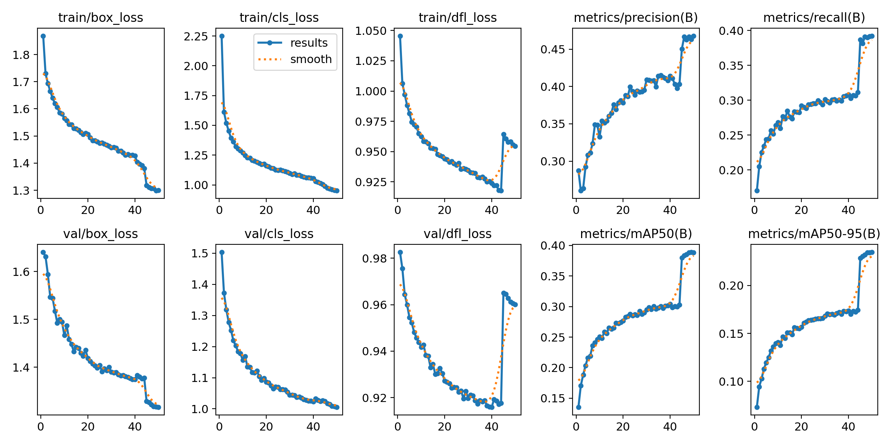
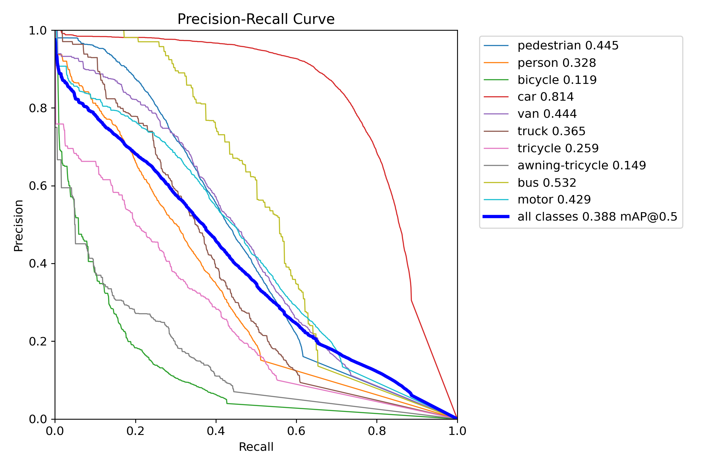
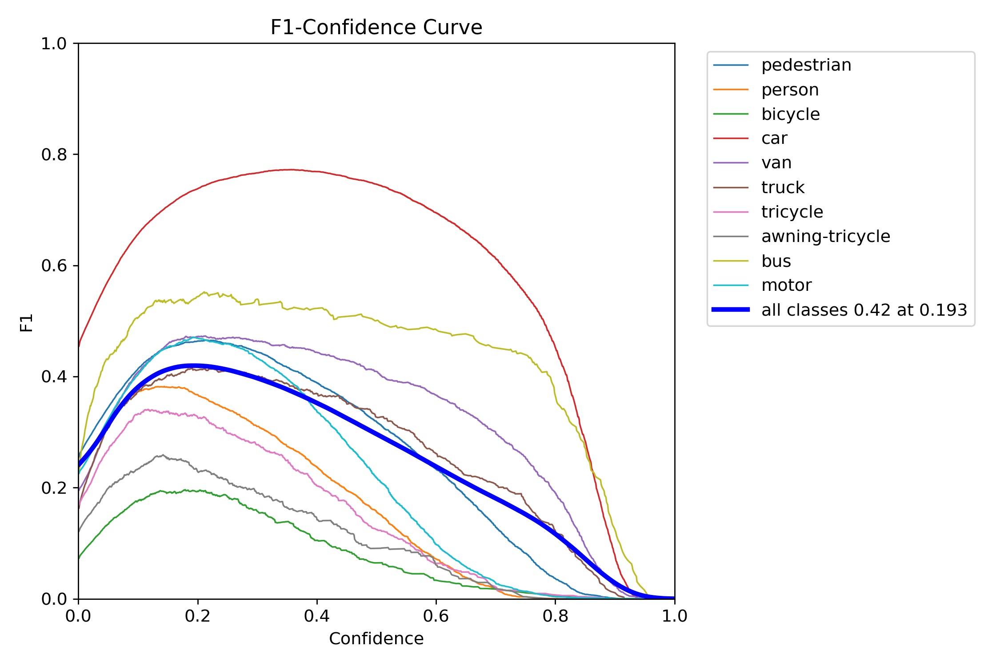

# 计算机视觉 HW2 实验报告（任务 2）

姓名：`贾昌昊`

学号：`23307140027`

---

## 1. 实验任务概述

本实验围绕“场景目标检测与视频多目标跟踪”展开，主要目标包括：

1. 使用 `VisDrone2019-DET` 无人机航拍目标检测数据集，微调训练 `YOLOv8n` 检测模型。
2. 将训练好的检测模型应用到一段实际测试视频中，结合 `ByteTrack` 完成逐帧多目标跟踪。
3. 在测试视频中选取一个密集交汇片段，分析遮挡条件下跟踪 ID 的稳定性。
4. 在视频画面中设置虚拟计数线，基于目标中心点和跟踪 ID 的连续性完成越线计数。

本实验的检测部分主要评价指标为 `Precision`、`Recall`、`mAP@0.5` 和 `mAP@0.5:0.95`；跟踪部分结合可视化结果与连续帧分析，重点观察目标在密集人流场景中的 ID 保持与遮挡鲁棒性。

---

## 2. 数据集与测试视频介绍

### 2.1 VisDrone2019-DET 数据集

本实验使用 `VisDrone2019-DET` 数据集进行目标检测训练。该数据集来自无人机航拍场景，具有目标尺度小、遮挡频繁、密集目标多等特点，适合验证检测器在复杂场景中的性能。

VisDrone 官方检测任务包含 10 个主要类别：

- `pedestrian`
- `person`
- `bicycle`
- `car`
- `van`
- `truck`
- `tricycle`
- `awning-tricycle`
- `bus`
- `motor`

为了适配 `Ultralytics YOLO` 训练流程，本实验先将原始 VisDrone 标注转换为 YOLO 检测格式，并生成本地数据配置文件 `visdrone_local.yaml`。

最终用于训练和验证的样本规模如下：

- 训练集：`6471`
- 验证集：`548`
- 测试集：`1610`

对应配置文件如下：

- [visdrone_local.yaml](datasets/visdrone_yolo/visdrone_local.yaml)

### 2.2 测试视频

跟踪与越线计数阶段选用了一段固定机位街景视频：

- 文件名：`12208359_1920_1080_60fps.mp4`
- 视频来源：<https://www.pexels.com/video/pedestrians-crossing-the-street-27700659/>
- 分辨率：`1920 × 1080`
- 帧率：`59.94 fps`
- 总帧数：`1800`
- 总时长：约 `30.03 s`

该视频具有以下特点：

- 机位稳定，适合多目标跟踪。
- 画面中主要目标为行人，局部区域存在明显的密集交汇。
- 中下部区域存在较明确的运动流向，适合设置虚拟越线计数线。

---

## 3. 模型与方法介绍

### 3.1 检测模型：YOLOv8n

本实验检测器采用 `YOLOv8n`。其中，`YOLOv8` 是 Ultralytics 提供的一代单阶段目标检测模型，`YOLOv8n` 为该系列中的轻量级 `nano` 版本，具有模型体积小、推理速度快、适合中等显存设备训练和部署的特点。

在本实验中，使用官方预训练权重 `yolov8n.pt` 作为初始化参数，在 VisDrone 数据集上进行微调训练。相比直接使用已经被他人微调过的权重，采用官方 `YOLOv8n` 预训练模型更符合题目中“微调训练 YOLOv8”的要求，也更便于实验报告中的方法说明。

### 3.2 跟踪算法：ByteTrack

视频多目标跟踪部分采用 `Ultralytics` 内置的 `ByteTrack`。ByteTrack 的基本思想是在逐帧检测的基础上，根据目标框位置、运动连续性以及检测置信度完成数据关联，从而为同一目标分配稳定的 `track_id`。

相较于单纯依靠高置信度框的跟踪方法，ByteTrack 会进一步利用低置信度检测结果辅助关联，因此在行人密集、短时遮挡较多的场景下，通常能取得更稳定的跟踪效果。

### 3.3 越线计数逻辑

越线计数通过以下步骤实现：

1. 在视频中设置一条虚拟直线。
2. 读取每个跟踪目标的检测框中心点坐标。
3. 判断该中心点在直线的哪一侧。
4. 若同一 `track_id` 的中心点从直线一侧移动到另一侧，则记为一次有效越线。
5. 为避免重复计数，每个 `track_id` 默认只统计一次。

---

## 4. 实验设置

### 4.1 数据预处理与格式转换

VisDrone 原始标注为逗号分隔格式，每一行包含：

- 左上角坐标 `x, y`
- 宽高 `w, h`
- `score`
- `category_id`
- `truncation`
- `occlusion`

本实验中首先完成以下转换：

1. 过滤 `score=0` 或非 10 类正式检测类别的标注。
2. 将边界框转换为 YOLO 所需的归一化中心点格式。
3. 按 `train / val / test` 划分复制图像和标签。
4. 自动生成 `datasets/visdrone_yolo/visdrone_local.yaml`。

对应脚本如下：

- [convert_visdrone_to_yolo.py](src/convert_visdrone_to_yolo.py)

### 4.2 检测训练超参数

本实验正式训练配置如下：

- 模型：`YOLOv8n`
- 初始权重：`yolov8n.pt`
- 输入尺寸：`960`
- Epoch：`50`
- Batch Size：`8`
- Workers：`0`
- 初始学习率：`0.001`
- 优化器：`auto`（由 Ultralytics 自动选择）
- 数据增强：默认 YOLO 数据增强策略
- 混合精度训练：启用 `AMP`
- 可视化平台：`SwanLab`

模型训练中途发生过一次中断，之后从 `last.pt` 继续恢复训练，因此最终 `args.yaml` 中记录的 `model` 与 `resume` 均指向恢复训练的权重路径。

### 4.3 跟踪与计数设置

正式视频处理阶段使用如下设置：

- 检测权重：`runs/task2_detect/visdrone_yolov8n/weights/best.pt`
- 跟踪器：`bytetrack.yaml`
- 计数线坐标：`(250, 820) -> (1670, 820)`
- 可视化字体缩放：`0.35`
- 边界框线宽：`1`

对应脚本如下：

- [track_and_count.py](src/track_and_count.py)
- [export_key_frames.py](src/export_key_frames.py)

### 4.4 训练环境

- 框架：`PyTorch + Ultralytics`
- 硬件：`NVIDIA GeForce RTX 4070 Laptop GPU (8GB)`
- 操作系统：`Windows`
- 日志平台：`SwanLab`

---

## 5. 检测模型训练结果

本实验使用 `YOLOv8n` 在 VisDrone 数据集上训练 `50` 个 epoch。根据训练输出 `results.csv`，最佳验证性能出现在最后一个 epoch，关键指标如下：

- 最优 epoch：`50`
- Precision：`0.4680`
- Recall：`0.3924`
- mAP@0.5：`0.3886`
- mAP@0.5:0.95：`0.2348`

对应训练结果文件如下：

- [results.csv](runs/task2_detect/visdrone_yolov8n/results.csv)
- [results.png](runs/task2_detect/visdrone_yolov8n/results.png)
- [PR_curve.png](runs/task2_detect/visdrone_yolov8n/PR_curve.png)
- [P_curve.png](runs/task2_detect/visdrone_yolov8n/P_curve.png)
- [R_curve.png](runs/task2_detect/visdrone_yolov8n/R_curve.png)
- [F1_curve.png](runs/task2_detect/visdrone_yolov8n/F1_curve.png)
- [best.pt](runs/task2_detect/visdrone_yolov8n/weights/best.pt)

从训练过程可以看出：

1. 前若干个 epoch 中，分类损失与框回归损失下降较快，说明模型能够较快适应 VisDrone 数据分布。
2. 在训练后期，`mAP@0.5` 和 `mAP@0.5:0.95` 仍有缓慢提升，说明模型仍在持续收敛。
3. 相比普通自然图像检测任务，VisDrone 场景中的小目标和密集目标较多，因此整体指标仍具有较大提升空间。

---

## 6. 检测结果分析

从验证集结果来看，`YOLOv8n` 已经能够较好检测出大部分可见目标，尤其是中近距离行人和车辆。但由于 VisDrone 具有典型的航拍视角特点，目标尺度小、目标间重叠严重，因此仍存在以下问题：

1. 对远距离小目标的检测置信度偏低。
2. 密集场景中相邻目标框容易重叠，增加误检和漏检风险。
3. 在类别外观相近、尺寸较小的情况下，`pedestrian` 与 `person` 等类别之间容易混淆。

总体而言，本实验训练出的 `YOLOv8n` 已具备完成后续视频跟踪与计数任务的基础能力，尤其适合本次 30 秒街景测试视频中的行人流动场景。

---

## 7. 视频多目标跟踪结果

在训练完成后，使用 `best.pt` 对测试视频 `12208359_1920_1080_60fps.mp4` 进行逐帧检测与跟踪，并导出跟踪结果表格：

- [12208359_1920_1080_60fps_tracks.csv](artifacts/tracking/12208359_1920_1080_60fps_tracks.csv)

根据跟踪结果统计：

- 视频总帧数：`1800`
- 有效输出的唯一 `track_id` 数量：`1739`
- 主要目标类别以 `pedestrian` 为主
- 还检测到了少量 `car`、`motor`、`person`、`bicycle` 等目标

跟踪可视化结果表明：

1. 在中下部较清晰区域，大多数行人的 ID 可以在连续帧之间保持稳定。
2. 在上半部分远处人流密集区域，由于目标尺寸更小、遮挡更强，检测框和 ID 的稳定性相对较弱。
3. ByteTrack 在短时遮挡场景下表现较为稳健，但在极其拥挤的位置仍存在短时丢失和误匹配风险。

---

## 8. 遮挡与 ID 跳变分析

本实验选取测试视频中第 `600-603` 帧作为连续分析片段，对应导出结果如下：

- [frame_00600.jpg](artifacts/analysis/key_frames_600/frame_00600.jpg)
- [frame_00601.jpg](artifacts/analysis/key_frames_600/frame_00601.jpg)
- [frame_00602.jpg](artifacts/analysis/key_frames_600/frame_00602.jpg)
- [frame_00603.jpg](artifacts/analysis/key_frames_600/frame_00603.jpg)

从这 4 帧可以看出，画面中部到右侧区域存在明显的密集交汇现象，多名行人同时向不同方向移动，目标间距离较近，部分检测框出现靠近甚至局部重叠，属于典型的遮挡与交汇场景。

结合连续帧观察，本片段中的大多数目标 `track_id` 仍能保持连续，没有出现大规模的明显 `ID switch`。这说明在短时遮挡、目标位移相对平缓的情况下，ByteTrack 能够利用相邻帧之间的运动连续性和检测结果完成较稳定的数据关联。

其原因主要包括：

1. 相邻帧之间时间间隔较短，目标位移较小，便于跟踪器基于历史运动轨迹进行匹配。
2. 该片段中虽然目标密集，但中下部的主要行人仍然保持了较清晰的外形和连续检测框。
3. ByteTrack 会结合高置信度和低置信度检测框共同完成关联，因此对短时检测波动具有一定鲁棒性。

不过，这一片段也体现出多目标跟踪的潜在困难：

1. 远处上半部分区域由于目标更小、数量更多，标签和框明显更加密集。
2. 当目标被持续遮挡或检测置信度明显下降时，跟踪器可能出现短暂丢失。
3. 一旦检测结果中断，目标在重新出现后就有可能被重新分配新的 ID，从而形成 `ID switch`。

进一步观察可发现，这一片段中还出现了较典型的漏检和误检现象。首先，在第 `602` 帧中，左侧原本连续出现的 `id404` 行人在该帧没有被成功检测出来，表现为一次短时漏检；这说明即使同一目标在相邻帧中总体连续可见，检测器仍可能因为局部遮挡、目标尺寸较小或瞬时外观变化而漏掉该目标。其次，除第 `603` 帧外，其余三帧都将左上角一根挂有交通警示牌的杆状物误识别为一个行人目标，并赋予了 `id4287`，只是该目标的检测置信度相对较低。这表明在复杂街景中，检测器对细长竖直结构、局部纹理和背景边缘有时会产生误判，而 ByteTrack 在接收到这一连续低置信度检测后，仍可能为其分配并短暂维持一个虚假的跟踪 ID。

因此，本实验中的这段视频片段更适合作为“密集交汇场景下 ID 基本保持稳定，但存在短时丢失、漏检与误匹配风险”的案例。总体而言，算法在短时遮挡场景下表现较好，但在更强遮挡、更远距离目标以及复杂背景干扰处仍存在提升空间。

---

## 9. 越线计数结果

本实验在视频中设置了一条横向虚拟计数线：

- 起点：`(250, 820)`
- 终点：`(1670, 820)`

计数依据为：同一 `track_id` 的中心点从计数线一侧运动到另一侧时，记为一次有效越线；同一目标默认只统计一次。

最终运行结果为：

- Final crossing count：`38`

这说明在整段 30 秒视频中，共统计到 `38` 个唯一跟踪目标跨越了该虚拟计数线。由于该视频以密集人流为主，因此越线计数结果主要反映的是行人通过路口下半部分区域的累计人数。

对应结果文件如下：

- [12208359_1920_1080_60fps_tracks.csv](artifacts/tracking/12208359_1920_1080_60fps_tracks.csv)

---

## 10. 训练过程可视化

本实验使用 `SwanLab` 对检测模型训练过程进行记录，并同步保存了本地训练曲线。对应的在线项目页面为：

- SwanLab 项目：<https://swanlab.cn/@jiab/cv-hw2-task2>

对于目标检测任务，训练过程中更常用的验证指标是 `Precision`、`Recall`、`mAP@0.5` 和 `mAP@0.5:0.95`；相较于分类任务中常见的单一 `Accuracy`，这些指标更能反映检测框定位与类别预测的综合效果。因此，本实验在可视化部分重点展示训练集和验证集上的 loss 曲线，以及验证集上的 `Precision / Recall / mAP` 曲线。

### 10.1 SwanLab 同步的训练/验证曲线

下图给出了训练过程中训练集上的 `box_loss / cls_loss / dfl_loss`，以及验证集上的 `Precision / Recall / mAP@0.5 / mAP@0.5:0.95` 变化趋势。可以看到，在前期若干个 epoch 中 loss 下降较快，而后期进入相对平稳的收敛阶段；与此同时，验证集上的 `mAP@0.5` 与 `mAP@0.5:0.95` 持续提升，并在训练后期达到最佳水平。

### 10.2 验证集上的 mAP / PR / F1 可视化

为了进一步分析检测性能，本实验还保留了验证集上的 PR 曲线和 F1 曲线。PR 曲线反映了不同阈值下精确率与召回率之间的权衡关系；F1 曲线则更直观地展示了精确率与召回率综合平衡后的整体表现。

综合这些可视化结果可以看出：

1. 训练集上的 `box_loss`、`cls_loss` 与 `dfl_loss` 整体呈下降趋势，说明模型在 VisDrone 数据集上完成了有效收敛。
2. 验证集上的 `Precision`、`Recall` 和 `mAP` 指标在训练中后期逐步趋于稳定，表明模型已经学到较为稳定的检测能力。
3. 由于 VisDrone 场景中小目标和密集目标较多，`mAP@0.5:0.95` 仍明显低于 `mAP@0.5`，这也反映出精确定位仍是该任务中的主要难点。

---

## 11. 结论

本实验基于 `VisDrone2019-DET` 数据集完成了目标检测模型微调，并进一步将训练好的模型应用于实际视频的多目标跟踪与越线计数任务。主要结论如下：

1. 使用官方预训练权重 `yolov8n.pt` 在 VisDrone 上微调后，模型最终在验证集上取得了 `mAP@0.5 = 0.3886`、`mAP@0.5:0.95 = 0.2348` 的结果，能够完成后续视频检测任务。
2. 在固定机位的 30 秒街景视频中，结合 `ByteTrack` 能够较稳定地为大多数目标分配连续 `track_id`，并完成逐帧多目标跟踪。
3. 在密集人流交汇和局部遮挡场景下，算法整体上能够维持多数目标的 ID 连续性，但在远处小目标和强遮挡区域仍存在短时丢失与误匹配风险。
4. 基于跟踪结果设置虚拟计数线后，最终统计到 `38` 个唯一目标跨越该线，说明检测与跟踪输出已经能够支持简单的视频行为统计任务。

总体来看，`YOLOv8n + ByteTrack` 这一组合能够较好完成本次作业要求的检测、跟踪、遮挡分析与越线计数任务，但在密集场景与小目标场景下仍有进一步优化空间。

---

## 12. 附录：关键结果文件

- [训练参数](runs/task2_detect/visdrone_yolov8n/args.yaml)
- [训练日志 CSV](runs/task2_detect/visdrone_yolov8n/results.csv)
- [训练曲线图](runs/task2_detect/visdrone_yolov8n/results.png)
- [最佳模型权重](runs/task2_detect/visdrone_yolov8n/weights/best.pt)
- [跟踪结果表格](artifacts/tracking/12208359_1920_1080_60fps_tracks.csv)
- [遮挡分析关键帧目录](artifacts/analysis/key_frames_600)

---

## 13. 仓库与模型权重链接

- GitHub 仓库地址：<https://github.com/jiab666/computer-vision-homework2-task2>
- 模型权重下载地址：<https://drive.google.com/drive/folders/1s-FRJuHNT2PVwj1gx36WHMxlbCFGXgK6?usp=drive_link>
